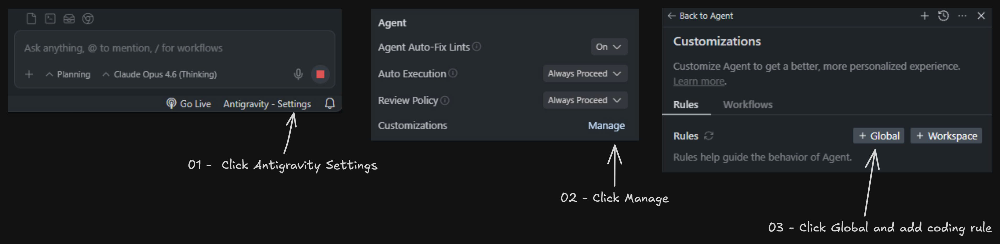

# Interactive Feedback MCP

## Why Use This?

By guiding the AI assistant to check in with the user instead of branching out into speculative, high-cost tool calls, this module can drastically reduce the number of premium requests. In some cases, it helps consolidate what would be up to 25 tool calls into a single, feedback-aware request — saving resources and improving performance.

## Quick Install (Recommended)

One command to clone, install, and configure everything automatically for **Antigravity IDE**:

**Windows (PowerShell):**
```powershell
irm https://raw.githubusercontent.com/nhatpse/Antigravity-MCP/v1.3.3/install.ps1 | iex
```

**Linux / macOS:**
```bash
curl -fsSL https://raw.githubusercontent.com/nhatpse/Antigravity-MCP/v1.3.3/install.sh | bash
```

> The installer will: clone the repo → install dependencies → configure MCP server → add coding rules. Just restart Antigravity after it finishes.

## Manual Installation

### Prerequisites

- [uv](https://docs.astral.sh/uv/) (Python package manager). **Note:** You do not need Python installed on your machine; `uv` will download and manage the required Python version automatically!
  - Windows: `irm https://astral.sh/uv/install.ps1 | iex`
  - Linux/Mac: `curl -LsSf https://astral.sh/uv/install.sh | sh`

### Setup

1. Clone or download this repository.

2. Install dependencies:
   ```sh
   cd path/to/interactive-feedback-mcp
   uv sync
   ```

3. Add the MCP server to your Antigravity configuration (`~/.gemini/antigravity/mcp.json`):

   ```json
   {
     "mcpServers": {
       "interactive-feedback-mcp": {
         "command": "uv",
         "args": [
           "--directory",
           "/path/to/interactive-feedback-mcp",
           "run",
           "server.py"
         ]
       }
     }
   }
   ```

   > **Note:** If `uv` is not in your system PATH, use the full path to the `uv` executable instead (e.g., `C:\\Users\\<user>\\AppData\\Local\\Python\\...\\Scripts\\uv.exe`).

## Prompt Engineering

For the best results, add the following as a coding rule in your AI assistant:

> Whenever you want to ask a question, always call the MCP `interactive_feedback`.  
> Whenever you're about to complete a user request, call the MCP `interactive_feedback` instead of simply ending the process.
> Keep calling MCP until the user's feedback is empty, then end the request.

### Adding Rules in Antigravity



1. Click **Antigravity - Settings** at the bottom of the chat panel.
2. In the Agent settings, click **Manage** next to Customizations.
3. Click **+ Global** to add a global coding rule, then paste the prompt above.

## Development

To run the server in development mode with a web interface for testing:

```sh
uv run fastmcp dev server.py
```

## Author

Created by **[nhatpse](https://github.com/nhatpse)**.

## License

This project is licensed under the [MIT License](LICENSE).

